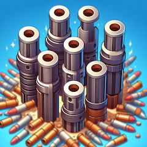

<h1 align="center">Hi 👋 I'm Adem Kaya</h1>
<h3 align="center">Game Developer · Shader Artist · Asset Creator · Software & AI Enthusiast</h3>

  
  
  

---

### 🧠 About Me

- 🎓 Bachelor's Degree, Computer Engineering (Doğuş University | Oct 2020 - Jun 2025)
- 🎓 High School Diploma, Mathematics (Habire Yahşi Anatolian High School | Sep 2016 - Jun 2020)

- 🎮 Experienced in developing mobile games, shaders, and rendering pipelines  
- 🧠 Exploring AI, agentic systems, and BERT-based NLP models  

---

### ⚙️ Tech Stack

**Programming Languages**: C#, C++, Java, Python 
**Web Technologies**: HTML, CSS, PHP, ASPX, SQL, VUE.JS, Firebase 
**Mobile App**: Flutter, Socket.io, LibreTranslate, Node.js 
**Game Design**: Unity, GameMaker, Programming, Level Design, Tool Creator, Asset Maker 
**Graphic Design**: Blender, 3D Modelling, HLSL, Shader Development, Animation, Shader Graph, Custom Renderer, 2D Pixel Drawing 
**Data Analysis**: Weka, MLP, Naive Bayes, KNN, scikit-learn, TensorFlow, Pandas, NumPy, Matplotlib 
**Languages**: Turkish - Native, English - C1

  
  
  
  
  
  
  
  
  
  
  
  
  
  
  
  
  
  
  
  
  
  
  
  
  
  
  
  
  
  
  
  
  
  
  
  
  

<i>Also experienced with: HLSL, Shader Graph, ASPX, DOTween, SRP/URP, Git</i>

---

### 🚀 Projects & Publications

#### 🧠 Turkish Extractive Summarizer (BERT)
> Graduation project: Context-aware summarization tool using BERT, LSA, and TextRank. Includes Turkish dataset, ROUGE evaluation, and web interface.  
> _Python · Transformers · NLP · Turkish · GPU-accelerated_

---

#### 🧠 Turkish Extractive Text Summarizer Using Bert and Multi-Model Comparison
> Conducted a comparative analysis of multiple extractive summarization algorithms—including BERT (Cosine Similarity, Clustering, Diversity-Based), LSA, NMF, and TextRank—on 110 Turkish news articles with human-written summaries. Each model's performance was evaluated using ROUGE-1, ROUGE-2, and ROUGE-L metrics to measure precision, recall, and F1-score, revealing the strengths and limitations of transformer-based and traditional methods for Turkish NLP tasks.  
> _February 2025 - June 2025 · Dogus University · #ModelComparison · #ROUGEEvaluation · #NLP · #isarc · #ISARC2025_

---

#### 🎨 Seamless Converter Shader  
> Hex-based triplanar projection shader for Unity. Removes tiling artifacts using randomized UV offset blending.  
> _Shader Graph · HLSL · Unity URP/HDRP · Texture Tools_

---

#### 🔁 Roll Shader  
> Wraps mesh geometry from one end to the other using vertex displacement, ideal for animated transitions and effects.  
> _Shader Graph · HLSL · Unity URP/HDRP · Vertex Animation_

---

#### 🧱 Toon Shader  
> Stylized lighting with crisp shadows and optional outlines, ideal for comic-style visuals and low-poly aesthetics.  
> _Shader Graph · HLSL · Unity URP/HDRP · NPR Rendering_

---

#### 🌊 Toon Water Shader  
> Features animated ripples, foam, and stylized wave behavior for cartoonish or low-poly water rendering.  
> _Shader Graph · HLSL · Unity URP/HDRP · Stylized FX_

---

#### 🕳 Hole Shader  
> Simulates dynamic 3D holes on surfaces and enables objects to fall through via custom depth masking logic.  
> _Shader Graph · HLSL · Unity URP/HDRP · Mesh Interaction_

---

#### 💎 Crystal Effect Shader  
> Reflective crystal shader with camera-angle-based lighting and cavity shading for a stylized, dynamic surface.  
> _Shader Graph · HLSL · Unity URP/HDRP · Stylized Materials_

---

#### 🎭 Character Portrait Shader  
> Customizable UI shader for character portraits with animated background, borders, and character layers.  
> _Shader Graph · Unity UI · URP · Custom Animation_

---

#### 🔦 Subsurface Scattering Shader  
> Simulates light transmission through soft surfaces like skin or wax using screen-space subsurface diffusion.  
> _Shader Graph · HLSL · Unity URP · Organic Materials_

---

#### 🧪 Fill Shader  
> Simulates fluid inside a container with physics-based bounce and dynamic fill control via exposed slider.  
> _Shader Graph · Unity UI · URP · Procedural Animation_

---

#### 🎯 Bulge Shader  
> Applies mesh deformation with adjustable radius, softness and bulge strength, ideal for stylized interactions.  
> _Shader Graph · HLSL · Unity URP/HDRP · Mesh Deformation_

---

#### 🌈 Auto Color Complete Shader  
> Creates smooth stepped gradients between two user-defined colors for procedural coloring and UI design.  
> _Shader Graph · HLSL · Unity URP · Gradient Mapping_

---

#### 📐 Triplanar Projection Shader  
> Projects textures on all three axes with seamless blending, eliminating the need for UV mapping.  
> _Shader Graph · HLSL · Unity URP/HDRP · Texture Projection_

---

#### 🪐 Spherical Projection Shader  
> Maps textures to spherical surfaces using polar coordinates, perfect for globes and curved geometry.  
> _Shader Graph · HLSL · Unity URP · Advanced UVs_

---

#### 🔄 Shader Graph Integrations  
> All shaders are fully compatible with URP, HDRP, and Built-in pipelines; each tested in production setups.  
> _Shader Graph · URP · HDRP · Built-in Support_

---

#### 🟢 Wobble Shader  
> Slime-like material with real-time squash and stretch reactions to motion and collisions for soft-body visuals.  
> _Shader Graph · HLSL · Unity URP · Physics-Based FX_

---

#### 📄 Agentic vs Traditional AI (Conference Paper)  
> Comparative research on reactive vs agentic AI systems — architectural flexibility, planning, ethics, and use cases in healthcare, robotics, and customer support.  
> _Autonomous AI · Ethics · Decision-Making · Evaluation Framework_

---

#### 📱 Mobile Games @ East Game Studio  
> Developed shaders, tools, and core mechanics for hyper-casual games under publishers like Supersonic & Rollic. Worked on optimization, rendering and VFX pipelines.  
> _Unity · ShaderGraph · Gameplay · Optimization · Mobile Publishing_

---

#### 💻 Frontend & Backend Intern @ Experilabs  
> Worked on a web-based restaurant tycoon game and a realtime chatting application. Focused on **frontend development** with Vue.js, TypeScript, and Flutter while also handling **backend integration** using Node.js, Firebase, and PostgreSQL.  
> Contributed to features such as user authentication, drag-and-drop UI mechanics, responsive design, admin panel foundations, and realtime communication with Socket.io.  
> _Vue.js · TypeScript · Firebase · Flutter · Node.js · PostgreSQL · Socket.io · Frontend · Backend_

---

#### 🎮 Game Maker & Asset Creator @ Occlusionn  
> Developing indie **party-style PC games** and creating professional **shader assets** for Unity. Focused on gameplay design, rendering pipelines, and advanced shader systems.  
> Experienced in building stylized effects, optimization tools, and custom rendering solutions for game developers.  
> _Unity · Blender · Shader Graph · C# · HLSL · Game Design · Asset Development_

---

### 🕹 Games I Contributed To

<table border="0">
  <tr>
    <td align="center" style="border:none;">
      <a href="https://apps.apple.com/tr/app/age-clash/id6447256658?l=tr" target="_blank">
         Age Clash
      </a>
    </td>
    <td align="center" style="border:none;">
      <a href="https://apps.apple.com/tr/app/aqua-match/id6739291923?l=tr" target="_blank">
         Aqua Match
      </a>
    </td>
    <td align="center" style="border:none;">
      <a href="https://play.google.com/store/apps/details?id=com.EastGameStudio.BallsnHoles&hl=en_US" target="_blank">
         Balls n Holes
      </a>
    </td>
    <td align="center" style="border:none;">
      <a href="https://play.google.com/store/apps/details?id=com.EastGameStudio.BarrelUp&hl=en_US" target="_blank">
         Barrel Up
      </a>
    </td>
    <td align="center" style="border:none;">
      <a href="https://play.google.com/store/apps/details?id=com.EastGameStudio.BulletSort&hl=en" target="_blank">
         Bullet Sort
      </a>
    </td>
    <td align="center" style="border:none;">
      <a href="https://play.google.com/store/apps/details?id=com.EastGameStudio.CarLotJam&hl=en" target="_blank">
         Car Lot Jam
      </a>
    </td>
  </tr>
  <tr>
    <td align="center" style="border:none;">
      <a href="https://play.google.com/store/apps/details?id=com.EastGameStudio.CardSlideSort&hl=en_US" target="_blank">
         Card Slide Sort
      </a>
    </td>
    <td align="center" style="border:none;">
      <a href="https://play.google.com/store/apps/details?id=com.EastGameStudio.ColorDemolish&hl=en_US" target="_blank">
         Color Demolish
      </a>
    </td>
    <td align="center" style="border:none;">
      <a href="https://play.google.com/store/apps/details?id=com.EastGameStudio.ConquerJam&hl=en_US" target="_blank">
         Conquer Jam
      </a>
    </td>
    <td align="center" style="border:none;">
      <a href="https://apps.apple.com/tr/app/domino-asmr-3d/id1645752523?l=tr" target="_blank">
         Domino ASMR 3D
      </a>
    </td>
    <td align="center" style="border:none;">
      <a href="https://play.google.com/store/apps/details?id=com.EastGameStudio.FillTheBus&hl=en_US" target="_blank">
         Fill The Bus
      </a>
    </td>
    <td align="center" style="border:none;">
      <a href="https://play.google.com/store/apps/details?id=com.EastGameStudio.GearGun&hl=en" target="_blank">
         Gear Gun
      </a>
    </td>
  </tr>
  <tr>
    <td align="center" style="border:none;">
      <a href="https://play.google.com/store/apps/details?id=com.EastGameStudio.GravityMerge&hl=en_US" target="_blank">
         Gravity Merge
      </a>
    </td>
    <td align="center" style="border:none;">
      <a href="https://play.google.com/store/apps/details?id=com.EastGameStudio.HookCatch&hl=en_US" target="_blank">
         Hook Catch
      </a>
    </td>
    <td align="center" style="border:none;">
      <a href="https://play.google.com/store/apps/details?id=com.EastGameStudio.JugglerEvolution&hl=en_US" target="_blank">
         Juggler Evolution
      </a>
    </td>
    <td align="center" style="border:none;">
      <a href="https://play.google.com/store/apps/details?id=com.EastGameStudio.KillingOrder&hl=en_US" target="_blank">
         Killing Order
      </a>
    </td>
    <td align="center" style="border:none;">
      <a href="https://apps.apple.com/tr/app/parking-match/id1626725246?l=tr" target="_blank">
         Parking Match
      </a>
    </td>
    <td align="center" style="border:none;">
      <a href="https://apps.apple.com/tr/app/spellcaster-3d/id1632902506?l=tr" target="_blank">
         Spellcaster 3D
      </a>
    </td>
  </tr>
  <tr>
    <td align="center" style="border:none;">
      <a href="https://apps.apple.com/tr/app/splatter-cube/id1620762210?l=tr" target="_blank">
         Splatter Cube
      </a>
    </td>
    <td align="center" style="border:none;">
      <a href="https://apps.apple.com/tr/app/tile-stack-jam/id6739998216?l=tr" target="_blank">
         Tile Stack Jam
      </a>
    </td>
    <td align="center" style="border:none;">
      <a href="https://apps.apple.com/tr/app/turn-2-sort/id1640230499?l=tr" target="_blank">
         Turn 2 Sort
      </a>
    </td>
    <td align="center" style="border:none;">
      <a href="https://play.google.com/store/apps/details?id=com.EastGameStudio.WordJam&hl=en_US" target="_blank">
         Word Jam
      </a>
    </td>
    <td align="center" style="border:none;">
      <a href="https://play.google.com/store/apps/details?id=com.EastGameStudio.ZombieHole&hl=en_US" target="_blank">
         Zombie Hole
      </a>
    </td>
    <td align="center" style="border:none;">
      <a href="https://restaurant-tycoon.netlify.app/" target="_blank">
         Restaurant Tycoon
      </a>
    </td>
  </tr>
</table>

---

### 🕹 Assets I made

<table border="0">
  <tr>
    <td align="center" style="border:none;">
      <a href="https://assetstore.unity.com/packages/vfx/shaders/seamless-converter-shader-320858" target="_blank">
         Seamless Shader
      </a>
    </td>
  </tr>
</table>

---

### 📊 GitHub Stats

  
  

---

### 📈 Contribution Graph

  

---

### 🧩 Profile Summary Card

  

---

### 🔗 Connect With Me

  
  
  

